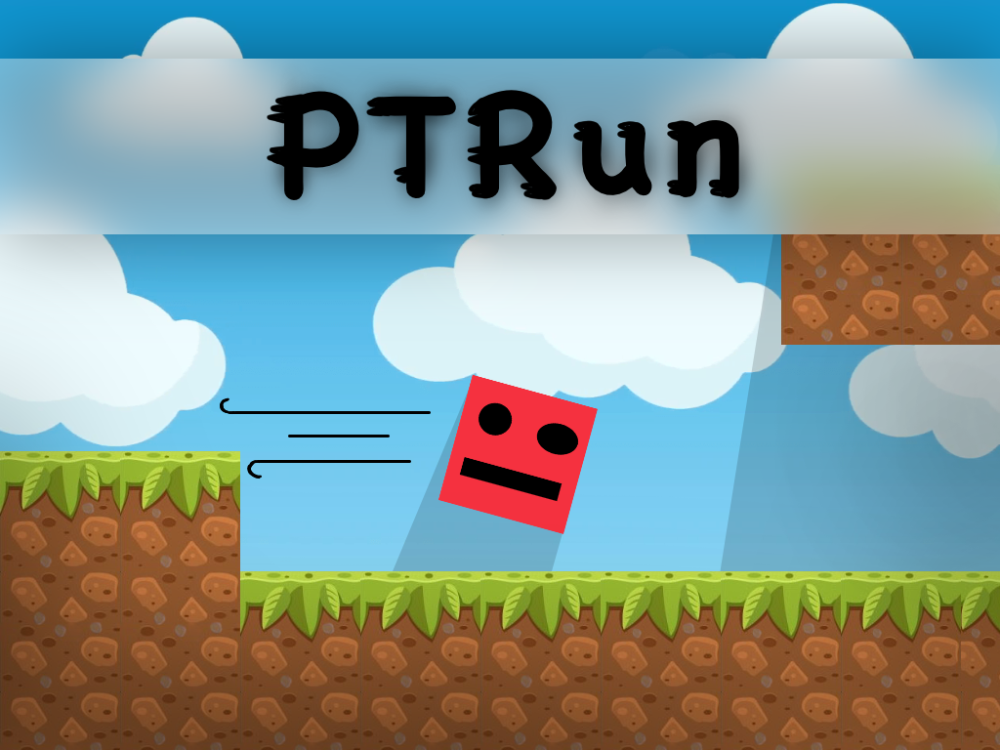

<h1 align="center">
  <br>
  <a href="https://github.com/ptr-geeks/ptrun/"></a>
  <br>
  PTRun
  <br>
</h1>

<h4 align="center">Overly simplified online arcade game.</h4>

<p align="center">
  <a href="https://github.com/ptr-geeks/ptrun/releases"></a>
  <a href="https://github.com/ptr-geeks/ptrun/actions/workflows/server.yaml"></a>
  <a href="https://github.com/ptr-geeks/ptrun/actions/workflows/client.yaml"></a>
</p>

## About The Project

**PTRun** is a simple web-based multiplayer game developed and driven as an educational project on Summer Camp for Computer Science (Poletni tabor računalništva 2021). Throughout the week the attendees have gained a lot of knowledge and implemented some amazing features. But the learning opportunities don't stop at the end of the summer camp and we hope everyone will use their new skills to grow and collaborate in the future.

It's core is written in [Go](https://golang.org/), [Node.js](https://nodejs.org/en/) and using [Protocol Buffers](https://developers.google.com/protocol-buffers/) for simple and efficient communication.

## Getting Started

Start here if you would like to get this project up and running on your local machine for development or testing purposes (or maybe just for fun).

### Requirements

Required tools to build and test:
- [Go](https://golang.org/dl/) >= 1.15
- [Node.js](https://nodejs.org/en/download/) >= 14.x.x
- [protoc](https://github.com/protocolbuffers/protobuf/releases)

### Building & running

After installing the tooling above you can build this game with the following steps:

**Generating protobuf code**

Generated `protobuf` code is not stored in this repository so make sure to re-generate if there are any changes to the `.proto` file.

```sh
# Client
protoc --proto_path=messages --js_out=import_style=commonjs,binary:./client/src messages/*.proto

# Server
protoc --proto_path=./messages --go_out=./ messages/*.proto
```

**Build server**

Navigate into `./server` and run the following commands:

```sh
go mod download
go build -o ../dist/ptrun-server ./cmd/ptrun-server/main.go
```

**Build client**

Navigate into `./client` and run the following commands:

```sh
npm install
npm build
```

## License

Distributed under the **MIT** License. See `LICENSE` for more information.

## Contributing

We believe that the open source community is an amazing place to learn, inspire and create. Any and all contributions are **greatly appreciated**! Just fork and open a Pull Request, simple as that.

## Team

Written by an enthusiastic team of programming prodigies: [@spelag](https://github.com/spelag), [@filips123](https://github.com/filips123), [@mytja](https://github.com/mytja), [@AljazekSLO](https://github.com/AljazekSLO), [@1aljaz](https://github.com/1aljaz), [@lukaheric](https://github.com/lukaheric), [@LukaKraseuc](https://github.com/LukaKraseuc), [@BigGrogl](https://github.com/BigGrogl), [@LucijanSkof](https://github.com/LucijanSkof), [@lstamac](https://github.com/lstamac) and [@galpodlipnik1](https://github.com/galpodlipnik1).

## Special Thanks

Special thanks goes to [Šola prihodnosti Maribor](https://www.sola-prihodnosti.si/en/) ([@tadejz](https://github.com/tadejz)), [ZOTKS](https://www.zotks.si/) and our awesome team of mentors [@jakakonda](https://github.com/jakakonda), [@davidmohar](https://github.com/davidmohar), [@duhecx](https://github.com/duhecx) & [@aJuvan](https://github.com/aJuvan) without whom this Summer Camp would not be possible.

<p align="center">
  <a href="https://www.sola-prihodnosti.si/en/"></a>
  <a href="https://github.com/ptr-geeks/ptrun"></a>
</p>
